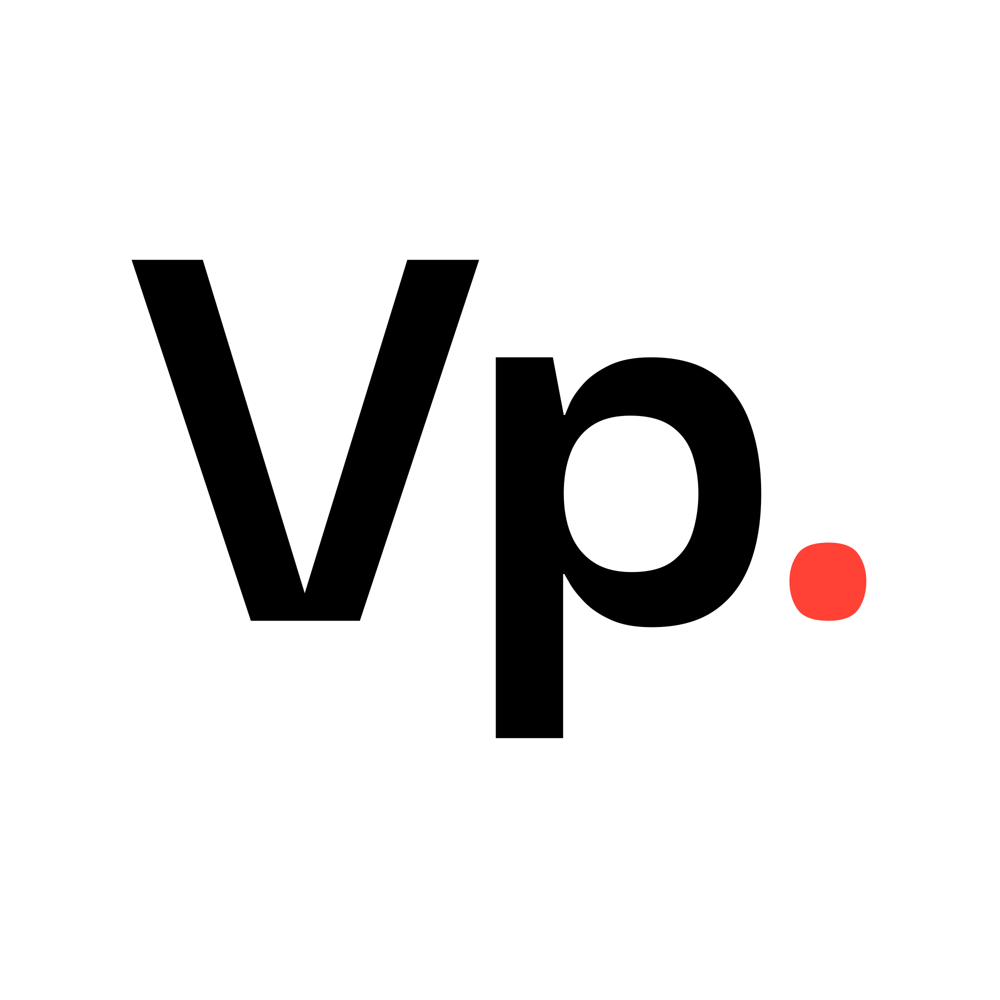
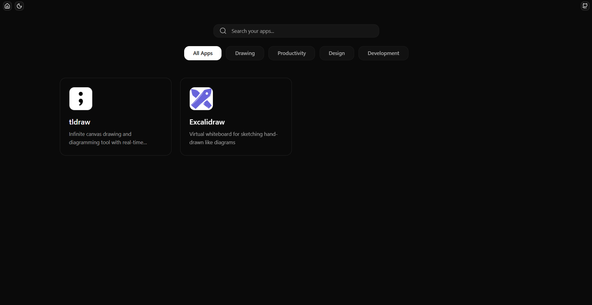
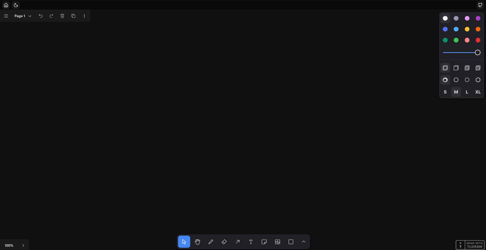
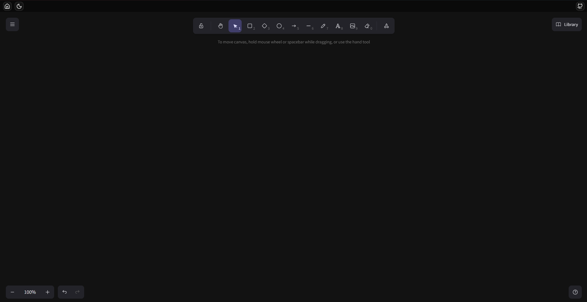

# VisionPad

  

## ✨ Overview

**VisionPad** is a modern, offline-first whiteboard app powered by [Tauri](https://tauri.app).  
It brings together the best open-source tools for sketching, diagramming, and productivity — all in one lightweight cross-platform desktop application.

## 🎨 Whiteboarding & Diagramming

- [x] Add **tldraw** (infinite canvas)
- [x] Add **Excalidraw** (hand-drawn style diagrams)
- [ ] Integrate **React Flow** for flowcharts and mind maps
- [ ] Explore **Rete.js** for visual programming / node-based editor

## 📝 Notes & Writing

- [ ] Add **TipTap** for rich-text editing (Notion-style editor)
- [ ] Add **Editor.js** (alternative block-style editor)
- [ ] Support **Markdown rendering** with `react-markdown`

## 📊 Productivity & Organization

- [ ] Add **React Kanban** for Trello-style boards
- [ ] Integrate **FullCalendar** for scheduling & planning
- [ ] Build **sticky notes** using `dnd-kit`

## 👨‍💻 Developer Tools

- [ ] Add **Monaco Editor** (VSCode in the app)
- [ ] Add **react-live** for live React code playground
- [ ] Add **Mermaid.js** for text-to-diagram rendering

## 🎨 Utilities

- [ ] Add **React Colorful** (color picker for all tools)
- [ ] Add **React PDF** (view & export PDFs)
- [ ] Add **react-dropzone** for drag-and-drop file uploads
- [ ] Add **browser-image-compression** for image optimization

## 🚀 Future Ideas

- [ ] Multi-tab workspace (switch between tools easily)
- [ ] Cloud sync / collaboration mode
- [ ] Plugin system for 3rd-party extensions
- [ ] Export to formats (PNG, SVG, PDF, Markdown, JSON)

## 📦 Downloads

Check the [Releases](https://github.com/KALU-c/visio-pad/releases) page to download VisionPad for your operating system:

- **Windows** → `.msi` installer or `.zip` portable
- **Linux** → `.deb`, `.rpm`, or `.AppImage`
- **macOS** → Universal binary (Intel + Apple Silicon)

## ⚡ Notes

- VisionPad is **offline-first** → all your data is stored locally.
- Dark/Light mode is supported out of the box.
- This project is still in **early development**, expect frequent updates!

## 📸 Screenshots

  
  
  

## 🤝 Contributing

Contributions are welcome! Feel free to open issues, suggest features, or submit PRs.  
If you’re adding a new tool, please update the checklist above.
